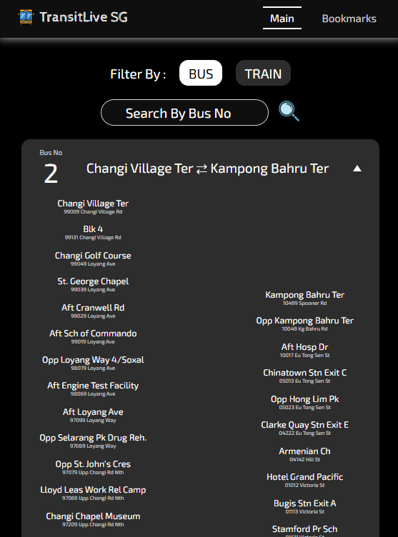
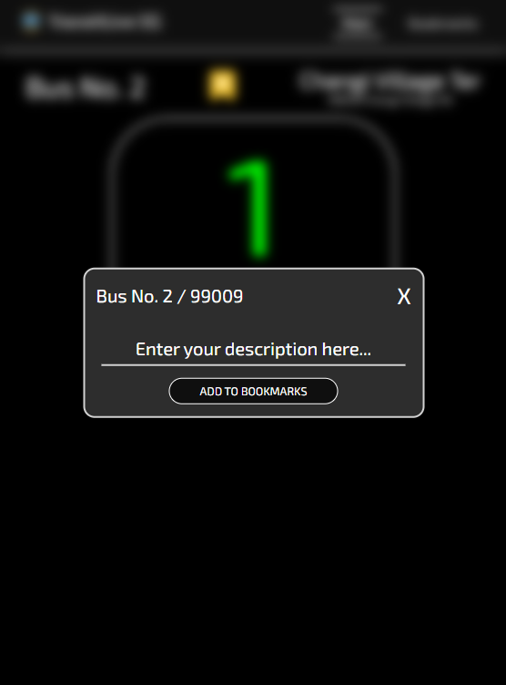
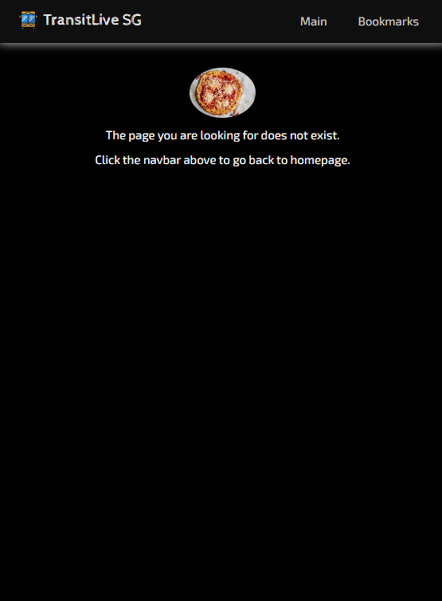

# TransitLive SG


## Table of Contents

- [Introduction](#introduction)
- [Getting Started](#getting-started)
- [App Description](#app-description)
  - [Main](#main)
  - [Details](#details)
  - [Bookmarks](#bookmarks)
  - [Not Found](#not-found)
- [Technologies Used](#technologies-used)
  - [Front-End](#front-end)
  - [API](#api)
- [Next Steps](#next-steps)
- [Attributions](#attributions)

## Introduction

TransitLive SG is a web based public transport tool, mainly for tracking bus and train in Singapore. This app allows user to search particular bus/train to get real-time ETA (estimated time arrival) and crowd density, and add it to personalized bookmarks.

## Getting Started

1.  Setup

    - Clone this repository: https://github.com/KevinPramudyanto/transit-live-sg.git

2.  Create Airtable

    - Sign up at [Airtable](https://airtable.com)
    - Create table with the following column: `service` , `stop` , `mode` , `description`
    - Choose single line text for each column

3.  Environment Variables

    - Create .env file in the root directory, and add the following line :

      ```
      VITE_AUTHORIZATION=Bearer <your-airtable-token>
      ```

      with `<your-airtable-token>` is your airtable secret API token

4.  Run

    - Navigate into the root directory, and execute the following commands on your terminal :

      ```
      npm i
      npm run dev
      ```

5.  Live URL

    - Alternatively, the app is also available at https://transit-live-sg.netlify.app

## App Description

There are 4 pages in total. Upon landing, user would be redirected to Main page where they can see all listed bus and train.

### Main


User would be able to filter and search the bus/train they would like to track.



They would also be able to select a bus service or train route. This would suggest the respective bus stop or train station accordingly.

Upon clicking of that particular bus stop or train station, user would be redirected to Details page.

### Details


Contains detail information about the selected bus or train, such as number, stop name, stop code, road, estimated time arrival, and crowd density.

User can also add this item to bookmarks. They would be given a choice to describe it or can also be left blank.



Upon adding of the item to bookmarks, user would be redirected to Bookmarks page and display it accordingly.

### Bookmarks


All bookmarks will be displayed in descending order by created time. Each item also can be removed from bookmarks.

### Not Found



Upon landing on Not Found page, users will be displayed random food images.

## Technologies Used

### Front-End

- HTML
- CSS
- JavaScript
- React

### API

- [ArriveLah](https://github.com/cheeaun/arrivelah) for estimated time arrival
- [sg-rail-crowd](https://github.com/cheeaun/sg-rail-crowd) for crowd density
- [Foodish](https://github.com/surhud004/Foodish) for random food images in Not Found page
- [Airtable](https://airtable.com) for storing data

## Next Steps

Features to implement in the future:

- Sign up and sign in
- Comment section for different user to share their review for a particular bus/train
- Utilize OneMap API and Geolocation API to get nearest bus/train
- Pagination or infinite scroll

## Attributions

- [Google Fonts](https://fonts.google.com/specimen/Exo+2) for Exo 2 font family
- [Google Fonts](https://fonts.google.com/specimen/Cabin+Sketch) for Cabin Sketch font family
- [Flaticon](https://www.flaticon.com/free-icon/bus-school_3066259) for bus icon in the navbar
- [Flaticon](https://www.flaticon.com/free-icon/loupe_751381) for loupe icon in the main page
- [Flaticon](https://www.flaticon.com/free-icon/empty-folder_7486768) for empty folder icon in the main page
- [Flaticon](https://www.flaticon.com/free-icon/star_10703080) for bookmark icon in the details page
- [Flaticon](https://www.flaticon.com/free-icon/bin_9790368) for bin icon in the bookmarks page
- [Flaticon](https://www.flaticon.com/free-icon/book_6983232) for book icon in the bookmarks page
- [Flaticon](https://www.flaticon.com/free-icon/pizza_2454219) for pizza icon in the not found page
- [MDN](https://developer.mozilla.org/en-US) for CSS and JavaScript references
- [React Documentation](https://react.dev) for React references
