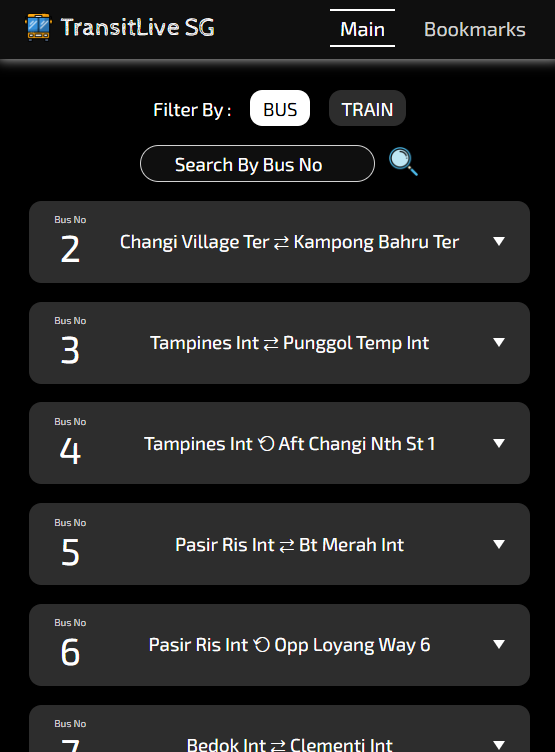
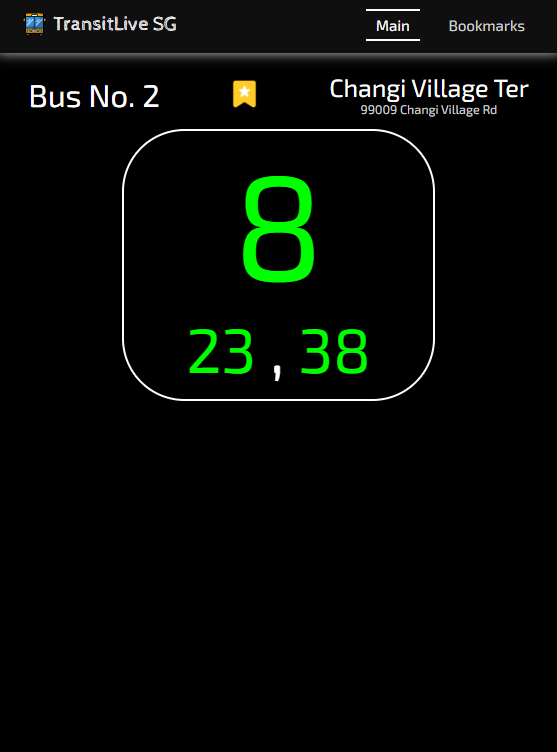
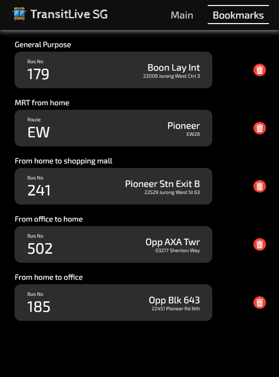

# TransitLive SG



## Table of Contents

- [Introduction](#introduction)
- [Getting Started](#getting-started)
- [App Description](#app-description)
  - [Main](#main)
  - [Details](#details)
  - [Bookmarks](#bookmarks)
- [Technologies Used](#technologies-used)
- [Next Steps](#next-steps)
- [Attributions](#attributions)

## Introduction

TransitLive SG is a web based public transport tool, mainly for tracking bus and train in Singapore. This app allows user to search particular bus/train to get real-time ETA (estimated time arrival) and crowd density, and add it to personalized bookmarks.

## Getting Started

1.  Setup

    - Clone this repository to your local machine.

2.  Create Airtable

    - Sign up at [Airtable](https://airtable.com)
    - Create table with the following column: service, stop, mode, description
    - Choose single line text for each column

3.  Create .env

    - Create .env file in the root directory, and add the following line :

      ```
      VITE_AUTHORIZATION=<your-airtable-token>
      ```

      with `<your-airtable-token>` is your airtable secret API token

4.  Run

    - Navigate into the root directory, and execute the following commands on your terminal :

      ```
      npm i
      npm run dev
      ```

## App Description

There are 4 pages in total.

### Main


Upon landing.

### Details



The detail information

### Bookmarks



Here is what the user can customize:

## Technologies Used

- HTML
- CSS
- JavaScript
- React

## Next Steps

Features to implement in the future:

- Add login features

## Attributions

- [Google Fonts](https://fonts.google.com/specimen/Exo+2) for Exo 2 font family
- [Google Fonts](https://fonts.google.com/specimen/Cabin+Sketch) for Cabin Sketch font family
- [Flaticon](https://www.flaticon.com/free-icon/bin_9790368) for bin icon in the bookmarks page
- [Flaticon](https://www.flaticon.com/free-icon/book_6983232) for book icon in the main page
- [Flaticon](https://www.flaticon.com/free-icon/star_10703080) for bookmark icon in the details page
- [Flaticon](https://www.flaticon.com/free-icon/bus-school_3066259) for bus icon in the navbar
- [Flaticon](https://www.flaticon.com/free-icon/empty-folder_7486768) for empty folder icon in the main page
- [Flaticon](https://www.flaticon.com/free-icon/loupe_751381) for loupe icon in the main page
- [Flaticon](https://www.flaticon.com/free-icon/pizza_2454219) for pizza icon in the not found page
- [MDN](https://developer.mozilla.org/en-US) for CSS and JavaScript references
- [React Documentation](https://react.dev) for React references
